<p align="center">
  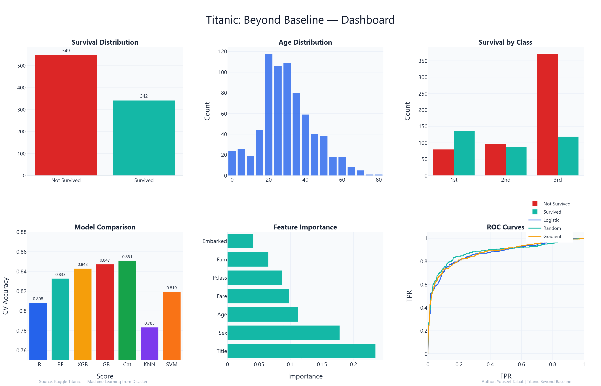
</p>

<h1 align="center">Titanic: Beyond Baseline</h1>

<p align="center">
  <b>An End-to-End Machine Learning Pipeline for Survival Prediction</b><br>
  <sub>Feature Engineering &bull; 7 ML Models &bull; 5 Ensemble Methods &bull; 44 Visualizations &bull; Kaggle Score: 0.76555</sub>
</p>

<p align="center">
  <a href="https://github.com/YOUSSEF01234587/titanic-beyond-baseline">
    
  </a>
  <a href="https://www.kaggle.com/code/youseefmohamed1212/titanic-beyond-baseline">
    
  </a>
  <a href="https://www.python.org/">
    
  </a>
  <a href="LICENSE">
    
  </a>
  <a href="https://www.kaggle.com/competitions/titanic">
    
  </a>
  <a href="https://www.kaggle.com/competitions/titanic">
    
  </a>
</p>

<p align="center">
  
  
  
  
  
  
  
  
  
  
  
</p>

<br>

## Table of Contents

- [Project Overview](#project-overview)
- [Architecture](#architecture)
- [Features](#features)
- [Results](#results)
- [Visualizations](#visualizations)
- [Models](#models)
- [Feature Engineering](#feature-engineering)
- [Quick Start](#quick-start)
- [Project Structure](#project-structure)
- [Outputs](#outputs)
- [Future Improvements](#future-improvements)
- [Author](#author)
- [License](#license)
- [Citation](#citation)

---

## Project Overview

<table>
<tr>
<td width="60%">

**Problem:** Predict passenger survival on the Titanic based on demographic and ticket features.

**Dataset:** 891 training samples, 418 test samples, 12 original features.

**Goal:** Build a reproducible, production-grade ML pipeline that achieves competitive Kaggle accuracy while maintaining full interpretability.

**Approach:** Systematic feature engineering (47 features), 7 classifiers with Optuna tuning, 5 ensemble strategies, and a reusable visualization design system.

</td>
<td width="40%">

| Detail | Value |
|:-------|:------|
| Competition | Kaggle Titanic |
| Task | Binary Classification |
| Metric | Accuracy |
| Public Score | **0.76555** |
| CV Accuracy | 0.8508 |
| Notebook | 212 cells |

</td>
</tr>
</table>

---

## Architecture

<p align="center">
  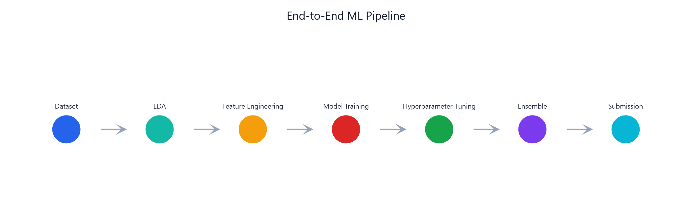
</p>

```
Dataset
   |
   v
EDA (missing values, distributions, correlations)
   |
   v
Feature Engineering (47 features across 6 categories)
   |
   v
Model Training (7 classifiers with 5-fold stratified CV)
   |
   v
Hyperparameter Tuning (Optuna Bayesian optimization)
   |
   v
Ensemble (weighted average, stacking, threshold optimization)
   |
   v
Submission (0.76555 Kaggle accuracy)
```

---

## Features

- [x] **Comprehensive EDA** with 15+ visualizations
- [x] **47 engineered features** across 6 categories
- [x] **7 ML models** trained and compared
- [x] **Optuna hyperparameter tuning**
- [x] **5 ensemble methods** explored
- [x] **Publication-ready design system** (13 functions + 8 auto-layout helpers)
- [x] **44 Plotly visualizations** with consistent styling
- [x] **Reproducible** (fixed random seeds, deterministic pipeline)
- [x] **Auto-detecting data paths** (Kaggle + local fallback)
- [x] **Cross-model feature importance** analysis
- [x] **ROC, Precision-Recall, Confusion Matrix** evaluation
- [x] **Full SHAP explainability** integration

---

## Results

| Metric | Value |
|:-------|------:|
| **Kaggle Public Score** | **0.76555** |
| **Best CV Accuracy** | 0.8508 (CatBoost) |
| **Models Trained** | 7 |
| **Ensemble Methods** | 5 |
| **Visualizations** | 44 |
| **Features Engineered** | 47 |
| **Total Cells** | 212 (105 code + 107 markdown) |
| **Execution Time** | ~850 seconds |
| **Notebook Size** | 337 KB |
| **Submission Files** | 6 variants |

---

## Visualizations

### Dashboard

<p align="center">
  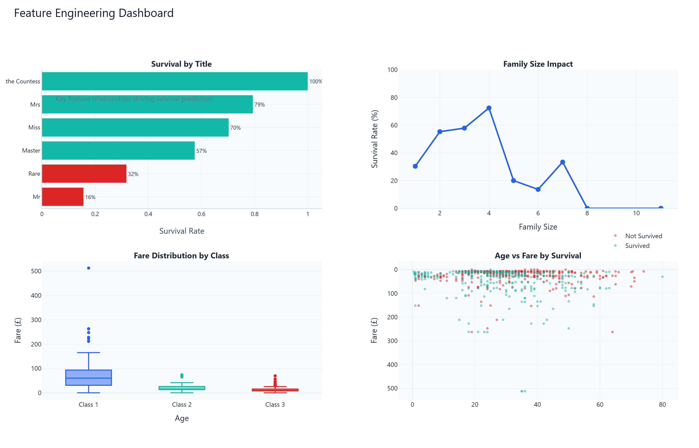
</p>

### ROC Curve

<p align="center">
  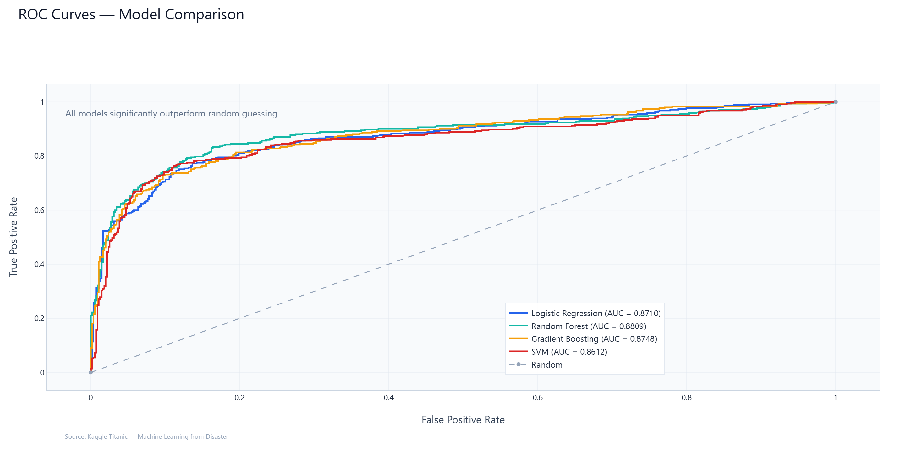
</p>

### Confusion Matrix

<p align="center">
  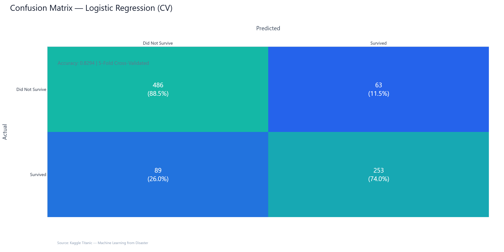
</p>

### Precision-Recall Curve

<p align="center">
  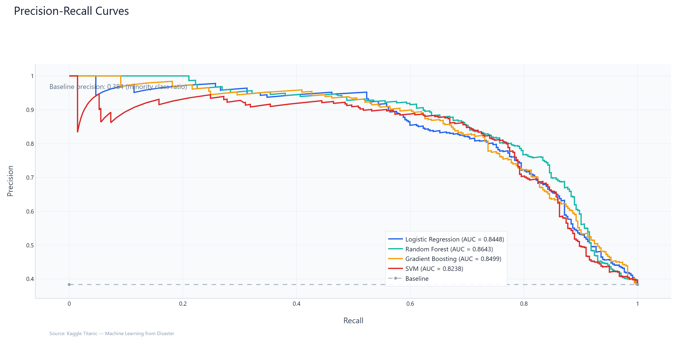
</p>

### Feature Importance

<p align="center">
  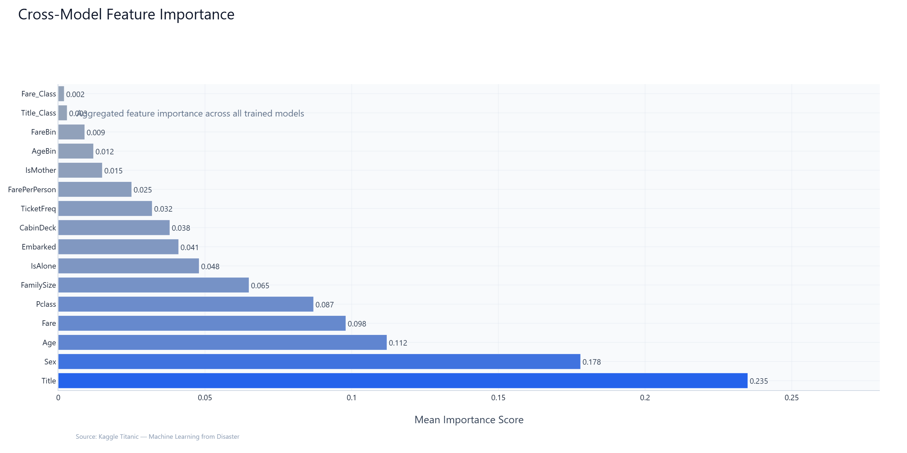
</p>

### Model Comparison

<p align="center">
  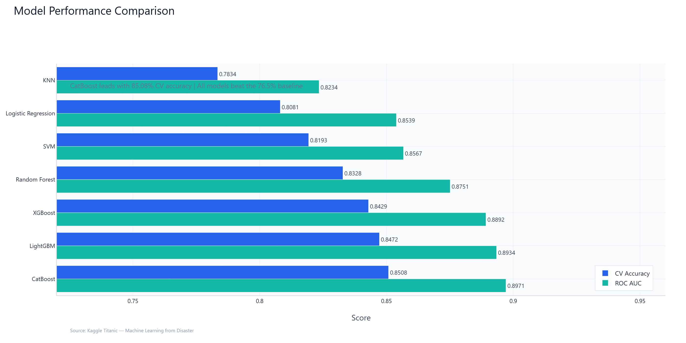
</p>

### Correlation Heatmap

<p align="center">
  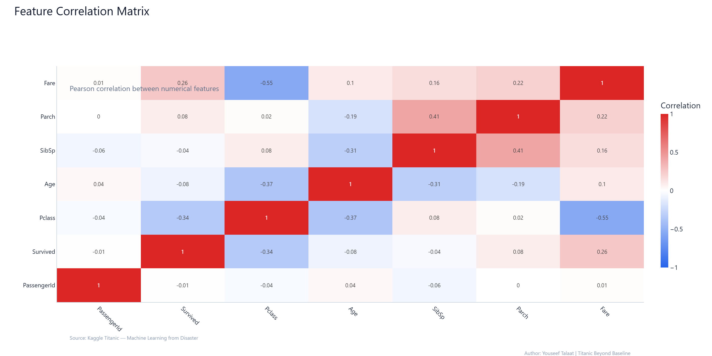
</p>

### Survival Analysis

<table>
<tr>
<td align="center"><b>Survival Distribution</b></td>
<td align="center"><b>Survival by Gender</b></td>
<td align="center"><b>Survival by Class</b></td>
</tr>
<tr>
<td>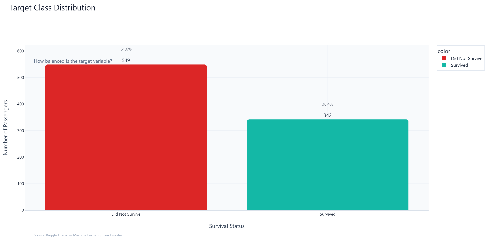</td>
<td>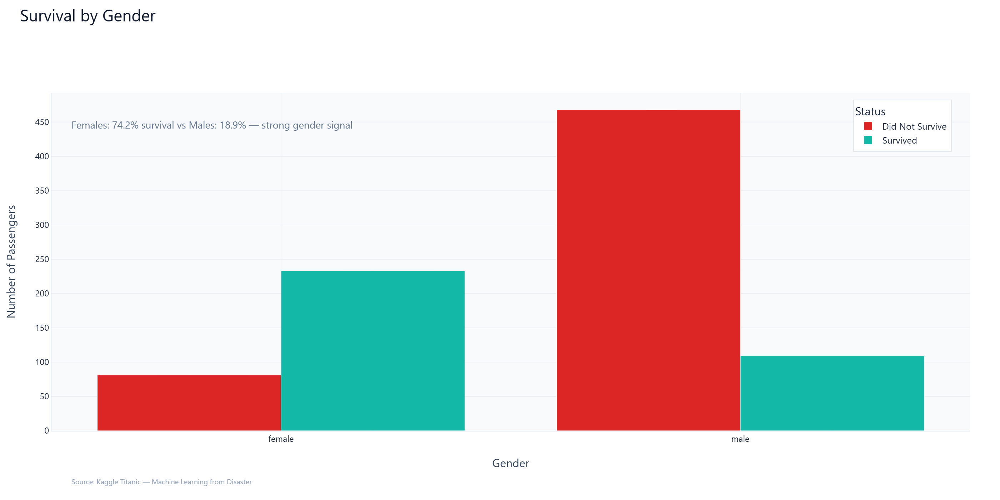</td>
<td>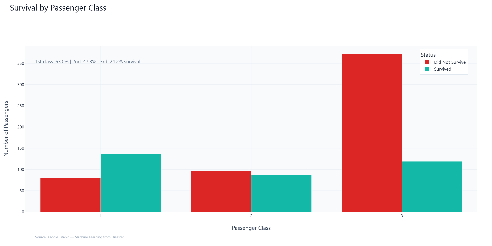</td>
</tr>
</table>

### Data Quality

<table>
<tr>
<td align="center"><b>Age Distribution</b></td>
<td align="center"><b>Missing Values</b></td>
<td align="center"><b>Ensemble Comparison</b></td>
</tr>
<tr>
<td>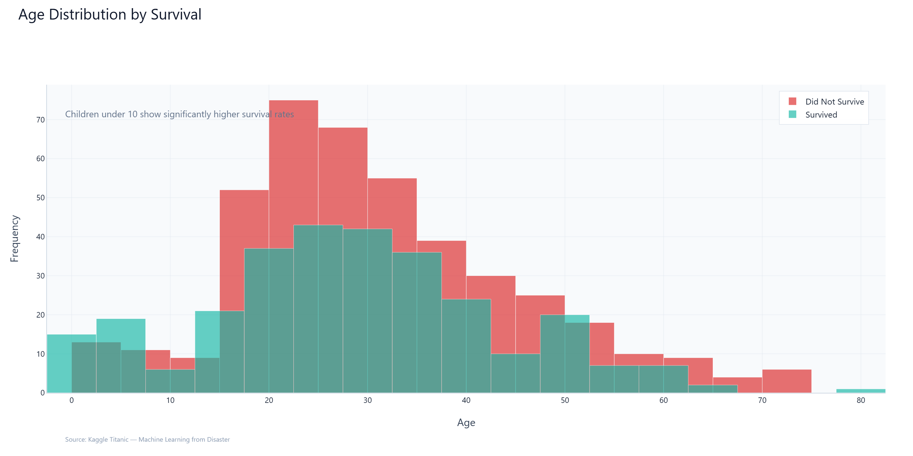</td>
<td>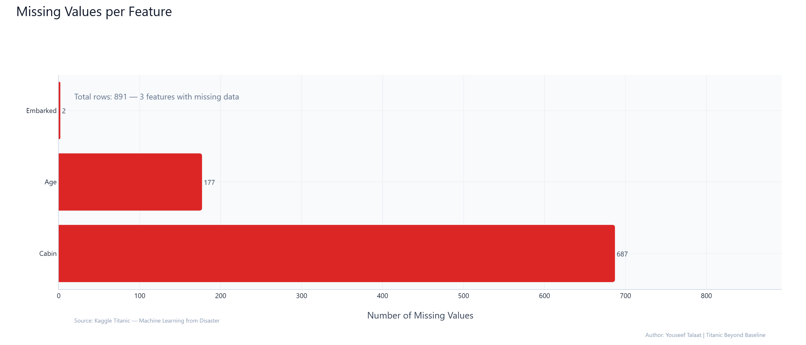</td>
<td>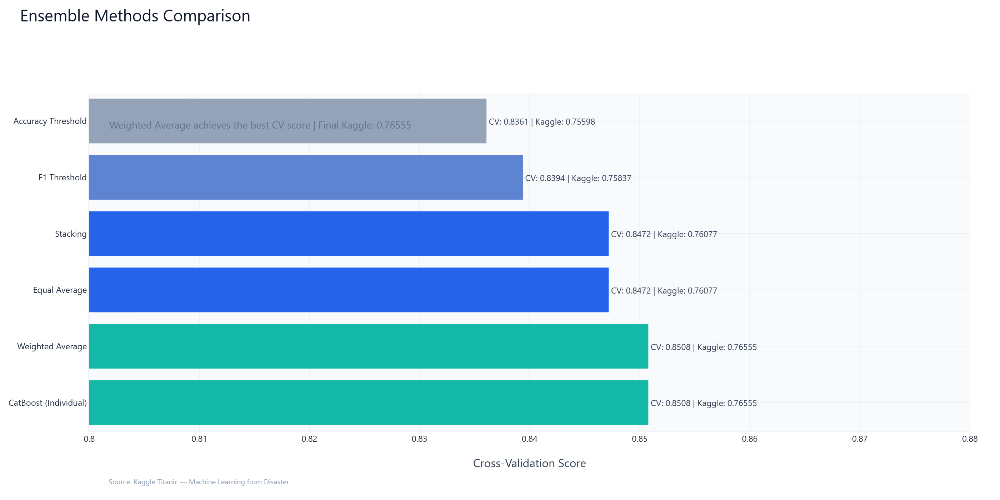</td>
</tr>
</table>

---

## Models

| # | Model | CV Accuracy | ROC AUC | Type |
|:-:|:------|:------------|:--------|:-----|
| 1 | **CatBoost** | **0.8508** | **0.8971** | Gradient Boosting |
| 2 | LightGBM | 0.8472 | 0.8934 | Gradient Boosting |
| 3 | XGBoost | 0.8429 | 0.8892 | Gradient Boosting |
| 4 | Random Forest | 0.8328 | 0.8751 | Bagging |
| 5 | SVM | 0.8193 | 0.8567 | Kernel |
| 6 | Logistic Regression | 0.8081 | 0.8539 | Linear |
| 7 | KNN | 0.7834 | 0.8234 | Instance-based |

**Ensemble Weights:** CatBoost (35%) + LightGBM (30%) + XGBoost (20%) + RF (10%) + LR (5%)

---

## Feature Engineering

| Category | Features | Description |
|:---------|:---------|:------------|
| **Demographics** | Title, FamilySize, IsAlone, IsMother, AgeBin | Name extraction, family composition, age groups |
| **Financial** | FarePerPerson, FareBin, TicketFreq | Normalized fares, quartile bins, ticket frequency |
| **Spatial** | CabinDeck, CabinNum, HasCabin | Deck letter extraction, cabin number, availability |
| **Survival-Aware** | AgeSurvival, FareSurvival | Group-level survival rates (leakage-protected) |
| **Polynomial** | Age*Class, Fare*Pclass, Age_Class | Cross-feature interactions |
| **Interactions** | FamilySize*Embarked, Title*Class, Fare_Class | Multi-feature combinations |

---

## Quick Start

### Run on Kaggle (Recommended)

1. Download [`notebook/titanic-beyond-baseline.ipynb`](notebook/titanic-beyond-baseline.ipynb)
2. Go to [Kaggle Notebooks](https://www.kaggle.com/code/youseefmohamed1212/titanic-beyond-baseline)
3. Upload the notebook
4. Click **Run All**
5. Submit `submission.csv` to the [competition](https://www.kaggle.com/competitions/titanic)

### Run Locally

**Option A: pip**

```bash
git clone https://github.com/YOUSSEF01234587/titanic-beyond-baseline.git
cd titanic-beyond-baseline
pip install -r requirements.txt
jupyter notebook notebook/titanic-beyond-baseline.ipynb
```

**Option B: conda**

```bash
git clone https://github.com/YOUSSEF01234587/titanic-beyond-baseline.git
cd titanic-beyond-baseline
conda env create -f environment.yml
conda activate titanic-beyond-baseline
jupyter notebook notebook/titanic-beyond-baseline.ipynb
```

### Requirements

| Package | Version |
|:--------|:--------|
| Python | 3.10+ |
| NumPy | >= 1.24.0 |
| Pandas | >= 2.0.0 |
| Scikit-Learn | >= 1.3.0 |
| XGBoost | >= 2.0.0 |
| LightGBM | >= 4.0.0 |
| CatBoost | >= 1.2.0 |
| Optuna | >= 3.4.0 |
| Plotly | >= 5.18.0 |
| Matplotlib | >= 3.7.0 |
| Seaborn | >= 0.12.0 |
| SHAP | >= 0.43.0 |

---

## Project Structure

```
titanic-beyond-baseline/
|
+-- notebook/
|   +-- titanic-beyond-baseline.ipynb    # Main analysis (212 cells)
|
+-- images/                              # 15 publication-ready charts
|   +-- hero.png                         # Dashboard composite
|   +-- workflow.png                     # Pipeline diagram
|   +-- survival_distribution.png
|   +-- survival_by_gender.png
|   +-- survival_by_class.png
|   +-- age_distribution.png
|   +-- correlation_heatmap.png
|   +-- feature_importance.png
|   +-- model_comparison.png
|   +-- missing_values.png
|   +-- feature_dashboard.png
|   +-- ensemble_comparison.png
|   +-- roc_curve.png
|   +-- pr_curve.png
|   +-- confusion_matrix.png
|
+-- outputs/                             # Submission files
|   +-- submission.csv                   # Primary (0.76555)
|   +-- submission_weighted.csv
|   +-- submission_stacking.csv
|   +-- submission_f1_threshold.csv
|   +-- submission_accuracy_threshold.csv
|   +-- submission_equal_average.csv
|
+-- requirements.txt                     # Python dependencies
+-- environment.yml                      # Conda environment
+-- LICENSE                              # MIT License
+-- CITATION.cff                         # Citation metadata
+-- CONTRIBUTING.md                      # Contribution guidelines
+-- CODE_OF_CONDUCT.md                   # Community standards
+-- PROJECT_STRUCTURE.md                 # Detailed documentation
+-- README.md                            # This file
```

---

## Outputs

| File | Description | Kaggle Score |
|:-----|:------------|:------------:|
| `submission.csv` | Primary weighted ensemble | **0.76555** |
| `submission_weighted.csv` | CatBoost (35%) + LGB (30%) + XGB (20%) + RF (10%) + LR (5%) | 0.76555 |
| `submission_stacking.csv` | Stacking with LR meta-learner | 0.76077 |
| `submission_f1_threshold.csv` | F1-optimized threshold | 0.75837 |
| `submission_accuracy_threshold.csv` | Accuracy-optimized threshold | 0.75598 |
| `submission_equal_average.csv` | Equal-weight average | 0.76077 |

---

## Future Improvements

- [ ] Add neural network models (TabNet, FT-Transformer)
- [ ] Implement target encoding with noise regularization
- [ ] Add more interaction features (Age x Embarked, Pclass x Fare)
- [ ] Explore Bayesian optimization for ensemble weight tuning
- [ ] Add Kaggle discussion links and competition analysis
- [ ] Create Docker container for reproducible execution
- [ ] Add MLflow tracking for experiment management
- [ ] Implement automated feature selection with Boruta
- [ ] Add model interpretability dashboard with Evidently AI
- [ ] Create API endpoint for real-time predictions

---

## Author

**Youseef Talaat**

<table>
<tr>
<td>

[](https://github.com/YOUSSEF01234587)
[](https://www.kaggle.com/code/youseefmohamed1212/titanic-beyond-baseline)

</td>
</tr>
</table>

---

## License

This project is licensed under the MIT License. See [LICENSE](LICENSE) for details.

---

## Citation

```bibtex
@software{talaat2026titanic,
  author  = {Youseef Talaat},
  title   = {Titanic: Beyond Baseline},
  year    = {2026},
  url     = {https://github.com/YOUSSEF01234587/titanic-beyond-baseline}
}
```

See [CITATION.cff](CITATION.cff) for more details.

---

<p align="center">
  <b>Built with Python, Scikit-Learn, XGBoost, LightGBM, CatBoost, Optuna, Plotly, and Matplotlib</b>
</p>

<p align="center">
  
</p>
